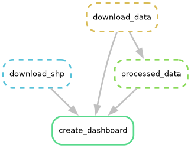

# DASHBOARD PARA ESTUDIAR LA METEOROLOGÍA DE CANARIAS

El objetivo es estudiar la variación de las variables de la temperatura del aire y precipitación acumulada con el paso del tiempo.

Para ello se usarán datos públicos del [Sistema de Observación Meteorológica de Canarias (GRAPHCAN)](https://opendata.sitcan.es/dataset/sistema-de-observacion-meteorologica-de-canarias).

Se usará GitHub Actions + SMAKEMAKE cuando esté terminado, para actualizaciones automátizadas cada mes.

### Estado del WORKFLOW de SNAKEMAKE

